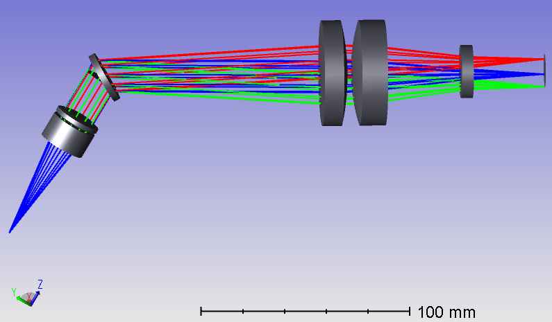
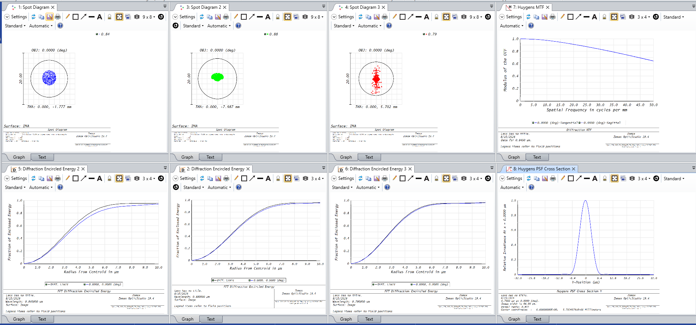

# OpenOCT Spectrometer Optical Design

This directory contains the optical design reference files for the OpenOCT
Spectro-800 system. The design is documented using a Zemax prescription-data
export and a STEP model so that the optical layout and mechanical envelope can
be reviewed without requiring a particular Zemax release.

## Shaded optical model

Shaded Zemax view of the spectrometer optical path. The image is provided as a
visual reference; the STEP file remains the source for 3D CAD geometry and the
prescription export remains the source for numerical optical data.

All optical components in the design are selected as off-the-shelf parts rather
than custom-designed optics. This is an intentional advantage of the OpenOCT
approach: catalog lenses, standard optical substrates, and commercially
available grating components reduce sourcing risk, lower fabrication complexity,
and make the spectrometer easier for other groups to reproduce.

The prescription keeps the catalog-style component references next to the
optical layout so the implementation path is clear. Vendor links for the lenses
used in the design are provided below for quick sourcing checks.

| Component reference | Vendor link |
| :--- | :--- |
| `ACA254-060-B` | [Thorlabs ACA254-060-B](https://www.thorlabs.com/thorproduct.cfm?partnumber=ACA254-060-B) |
| `AC508-150-B` | [Thorlabs AC508-150-B](https://www.thorlabs.com/thorproduct.cfm?partnumber=AC508-150-B) |
| `ED47-318` | [Edmund Optics #47-318](https://www.edmundoptics.com/p/50mm-dia.-x-150mm-fl-nir-ii-coated-achromatic-lens/7336) |
| `LC1582` | [Thorlabs LC1582](https://www.thorlabs.com/thorproduct.cfm?partnumber=LC1582) |
| VPH grating, 1200 l/mm at 840 nm | [Wasatch Photonics 1200 l/mm at 840 nm](https://wasatchphotonics.com/product/1200-lmm-at-840nm/) |

Vendor pages should be checked for the current coating, stock status, and
regional availability before ordering.

## Evaluation summary

The evaluation image provides a quick visual summary of the design, including
spot diagrams at the evaluated wavelengths, diffraction encircled-energy plots,
Huygens MTF, and a Huygens PSF cross section.

## Repository contents

| File | Description |
| :--- | :--- |
| `Evaluation.PNG` | Zemax evaluation summary containing spot diagrams, encircled-energy plots, MTF, and PSF cross section. |
| `ShadedModel.png` | Rendered shaded optical layout with traced rays and scale bar. |
| `Zemax_Prescription_Data.md` | Reformatted export of the Zemax System/Prescription Data. It contains the system settings, wavelength and field definitions, surface sequence, materials, spacings, and selected first-order results. |
| `OpenOCT_spec_3D.STP` | STEP representation of the spectrometer design for CAD inspection and mechanical integration. |

## Design overview

The prescription describes a sequential, on-axis optical system with a single
design wavelength of 0.840 um and one on-axis field. The optical path contains
three functional sections:

1. **Input objective:** a compact refractive group using N-SF57 and N-SSK2,
	followed by the system stop.
2. **Spectral section:** a fused-silica substrate assembly containing a
	diffractive grating surface. The grating is represented by the `DGRATING`
	surface in the prescription.
3. **Relay and image-forming optics:** a long free-space section followed by a
	multi-element relay using SFL6, LAKN22, and silica elements, ending at the
	image surface.

The prescription uses millimeters for lens units. The object-space numerical
aperture is 0.13, and the system aperture stop is surface 6, immediately before
the grating assembly.

## Key prescription values

| Parameter | Value |
| :--- | :--- |
| Number of surfaces | 21, including object, stop, and image surfaces |
| Primary wavelength | 0.840 um |
| Field definition | One field, 0.0 deg, weight 1.0 |
| Object-space NA | 0.13 |
| Image-space NA | 0.07215254 |
| Effective focal length | 64.70061 mm |
| Image-space F/# | 2.721626 |
| Working F/# | 7.002377 |
| Entrance pupil diameter | 23.77278 mm |
| Exit pupil diameter | 27.54368 mm |
| Total track | 251.4813 mm |
| Stop radius | 7.903976 mm |

The complete surface-by-surface data, including radii, thicknesses, glass
types, clear diameters, and component comments, is maintained in
[`Zemax_Prescription_Data.md`](Zemax_Prescription_Data.md).

## Zemax file availability

The native Zemax project file (`.ZMX`/`.ZEMAX`) is intentionally not included.
Zemax project files can be affected by software-version and catalog
compatibility differences, which may prevent another user from opening the
file reliably. Instead, this repository includes the version-neutral
prescription-data export in Markdown form. It preserves the numerical
prescription needed for review and reconstruction while avoiding a forced
Zemax version dependency.

The export does not replace every part of a native Zemax project. In
particular, users should verify grating-specific settings, coating data,
aperture definitions, tolerances, optimization operands, and catalog versions
in the originating Zemax project before using the design for final performance
claims or fabrication.

